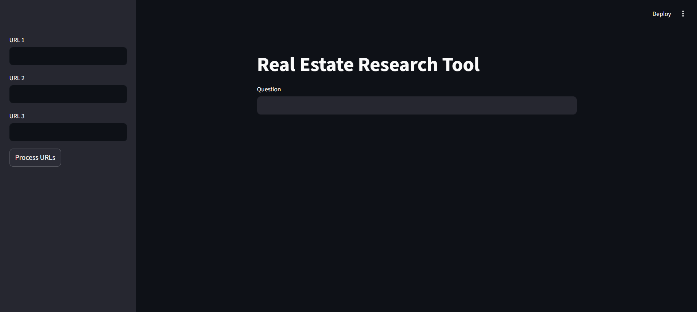

# 🏡 Real-Estate-Assistant-Using-RAG

A Retrieval-Augmented Generation (RAG) application that helps users analyze real-estate news articles and obtain accurate, context-aware answers from them. Users can provide article URLs, build a searchable knowledge base, and interact with the content through natural language questions.



## ✨ Features

- Load and process real-estate news articles directly from URLs.
- Extract article content using LangChain's URL document loader.
- Split and preprocess article text for efficient retrieval.
- Generate vector embeddings using HuggingFace Embedding Models.
- Store embeddings in ChromaDB for fast semantic search.
- Ask questions in natural language and receive context-aware answers.
- Retrieve relevant information from processed articles using RAG.
- Display source references used to generate answers.
- Simple and interactive user interface built with Streamlit.

---

## 🛠️ Technologies Used

- Python
- LangChain
- Groq API (Llama 3)
- HuggingFace Embeddings
- ChromaDB
- Streamlit
- Unstructured URL Loader
- Python Dotenv

---

## ⚙️ Installation & Setup

### Clone the Repository

```bash
git clone https://github.com/trijesh61/Real-Estate-Assistant-Using-RAG.git
cd Real-Estate-Assistant-Using-RAG
```

### Install Required Packages

```bash
pip install -r requirements.txt
```

### Set Up Environment Variables

Create a `.env` file in the project root directory:

```env
GROQ_MODEL=your_model_name
GROQ_API_KEY=your_groq_api_key
```

### Launch the Application

```bash
streamlit run main.py
```

The application will start locally and open in your default web browser.

---

## 🚀 Usage

1. Enter one or more article URLs in the sidebar.
2. Click **Process URLs** to load and analyze the articles.
3. The application will:
   - Extract article content
   - Split the text into chunks
   - Generate embeddings using HuggingFace models
   - Store vectors in ChromaDB
4. Enter your question once processing is complete.
5. Receive an AI-generated answer along with relevant source references.

---

## 💡 Sample Article URLs

- https://www.cnbc.com/2024/12/21/how-the-federal-reserves-rate-policy-affects-mortgages.html
- https://www.cnbc.com/2024/12/20/why-mortgage-rates-jumped-despite-fed-interest-rate-cut.html
- https://www.cnbc.com/2024/12/17/wall-street-sees-upside-in-2025-for-these-dividend-paying-real-estate-stocks.html

### Example Questions

- What was the 30-year fixed mortgage rate mentioned in the articles?
- How many times did the Federal Reserve lower interest rates in 2024?
- What is the Federal Reserve's outlook on interest rates for 2025?
- Which real-estate stocks are expected to perform well in 2025?
- Why did mortgage rates rise despite the Fed's rate cut?

---

## 🔄 Workflow

```text
News Article URLs
        ↓
Document Loading
        ↓
Text Splitting
        ↓
HuggingFace Embeddings
        ↓
ChromaDB Vector Store
        ↓
Semantic Retrieval
        ↓
Relevant Context
        ↓
Llama 3 (Groq)
        ↓
Answer + Sources
```

---

## 🎯 Learning Outcomes

- Retrieval-Augmented Generation (RAG)
- Semantic Search
- Vector Databases
- Embedding Models
- LangChain Pipelines
- LLM Integration using Groq
- Streamlit-based AI Applications

